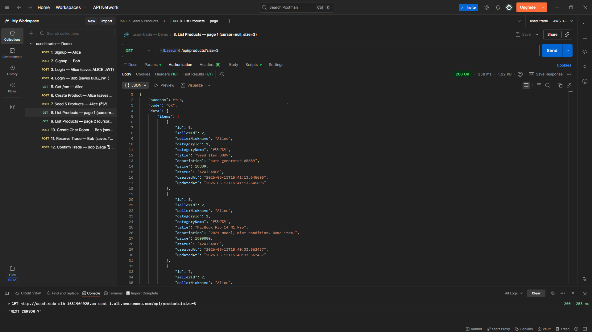
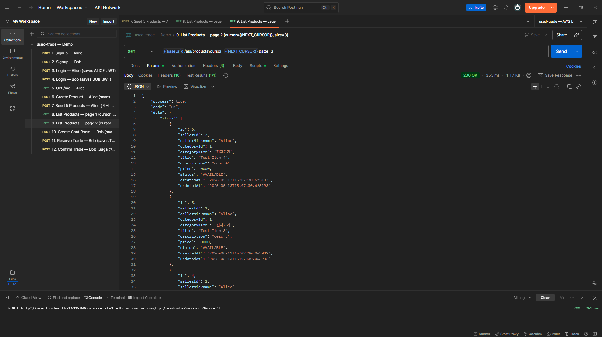
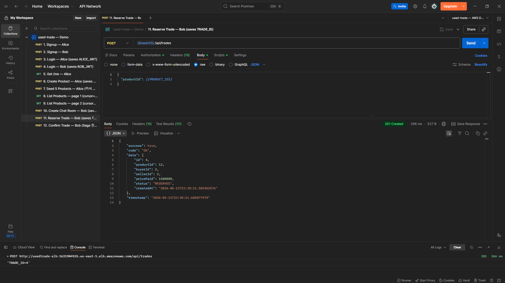
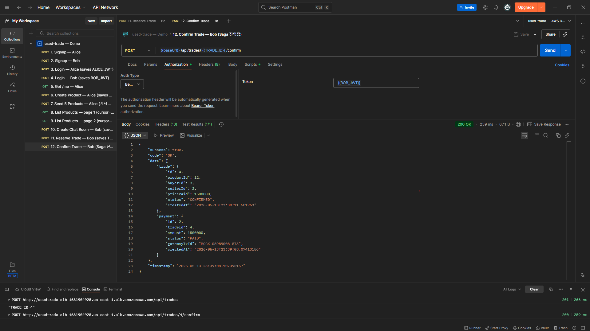
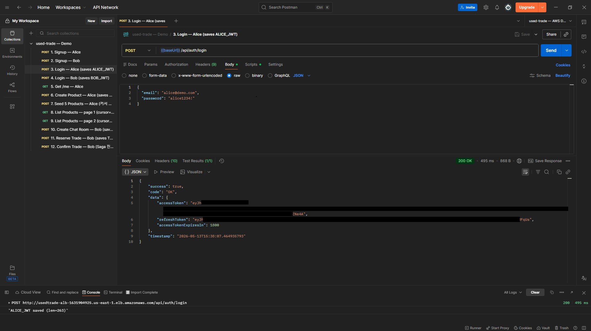
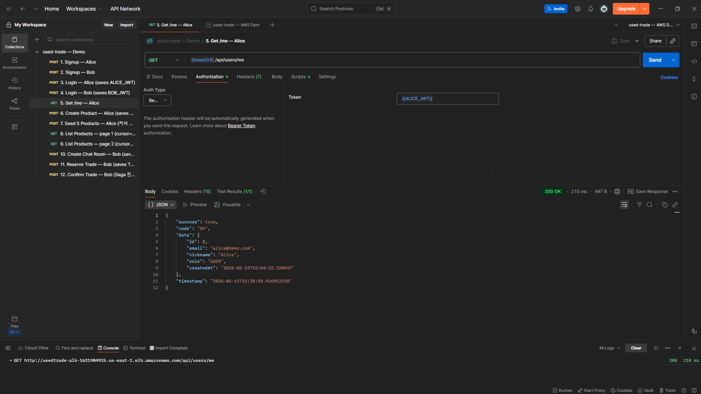

# used-trade — 중고거래 백엔드 포트폴리오

> 모듈러 모놀리스 위에서 **동시성 · 분산 트랜잭션 · 멀티 인스턴스 실시간 메시징** 의 트레이드오프를 수치로 입증한 백엔드 프로젝트.
>
> Java 21 · Spring Boot 3.5 · MySQL 8 · Redis 7 · Docker · AWS (EC2 / RDS / ElastiCache / ALB)

---

## 한 줄 요약

> *"동일 상품 동시 예약 20건 중 거래가 정확히 1건만 생성되고, 두 인스턴스에 흩어진 채팅 참여자에게도 같은 메시지가 도달하며, 결제가 실패하면 거래는 보상되고 상품 상태는 원복된다 — 통합 테스트로 입증."*


> 두 브라우저 탭이 같은 ALB DNS 에 접속 → ALB round-robin 으로 서로 다른 EC2 인스턴스에 라우팅 → Redis Pub/Sub 채널 `chat.broadcast` 가 인스턴스 간 메시지 릴레이 → 양쪽 모두 즉시 수신. **ADR-3 핵심 시연**.

---

## 핵심 어필 카드

| # | 주제 | 입증 | 코드 / 문서 |
|---|---|---|---|
| ADR-1 | 모듈러 모놀리스 (vs MSA) | 도메인 5종이 한 JVM 안에서 패키지 의존성만으로 격리. 추후 분리 가능 구조 | [README §ADR-1](#adr-1--모듈러-모놀리스-vs-msa) |
| ADR-2 | 낙관적 락 + Spring Retry (vs 비관적 / Redisson) | N=20 동시 reserve → 보호 없을 때 중복 거래 3건, 보호 있을 때 정확히 1건. N=50 까지 무결성 유지 (p95 193ms) | [docs/adr/002](docs/adr/002-optimistic-locking.md) |
| ADR-3 | Redis Pub/Sub 멀티 인스턴스 채팅 (vs Sticky / Kafka) | 두 JVM 인스턴스에 흩어진 STOMP 구독자가 같은 메시지 수신 — `ChatStompDualInstanceTest` 통합 테스트로 입증 | [docs/adr/003](docs/adr/003-redis-pubsub-chat.md) |
| ADR-4 | 상품 목록 커서 페이징 (vs OFFSET) | 10만 건 깊은 페이지에서 OFFSET 14.40ms → CURSOR 0.71ms, **20.1배** (EXPLAIN 첨부) | [docs/adr/004](docs/adr/004-cursor-pagination.md) |
| Saga | trade.confirm — payment + trade 보상 (부분 Saga) | PG 결제 실패 → `trade.cancel` 보상 + Product 복원 **자동화**. T2 / 크래시 / 보상 자체 실패 케이스는 운영자 수동 — Outbox 합류 후 자동화 (ADR-5) | [TradeSagaService](src/main/java/com/portfolio/used_trade/trade/service/TradeSagaService.java) · [§한계](#saga-의-현재-범위--의도된-한계) |
| AWS | 매니지드 인프라 실 배포 | EC2 2대 + ALB + RDS + ElastiCache. 인프라 명령 재현 가능하게 문서화 | [docs/deploy/aws-setup.md](docs/deploy/aws-setup.md) |

> 시연 URL 은 비용 절감을 위해 평소엔 정지 상태입니다 (~$1/일 가동). 면접 직전 재배포 — 본 README §[AWS 재배포](#aws-재배포-시연-시) 참고.

---

## 아키텍처

### 로컬 (단일 JVM)

```
            ┌────────────────────────────────────────────────┐
            │  Spring Boot 3.5 (Java 21)                     │
  HTTP/WS   │  ┌──────┐ ┌────────┐ ┌──────┐ ┌──────┐ ┌─────┐ │
   ─────►   │  │ user │ │product │ │trade │ │ chat │ │ pay │ │
            │  └──┬───┘ └────┬───┘ └──┬───┘ └──┬───┘ └──┬──┘ │
            │     └──────────┴────────┼────────┴────────┘    │
            │                    common (config / exception) │
            └──────────────┬───────────────┬─────────────────┘
                           │ JDBC          │ Lettuce
                       ┌───▼────┐      ┌───▼───┐
                       │ MySQL  │      │ Redis │
                       │   8    │      │   7   │
                       └────────┘      └───────┘
```

### AWS 배포 (`us-east-1`)

```
                    Internet
                       │
                  ┌────▼────┐
                  │   ALB   │   (sg-alb : 80 in)
                  └────┬────┘
            ┌──────────┴──────────┐
            │                     │
       ┌────▼─────┐         ┌─────▼────┐
       │ EC2 #1   │         │ EC2 #2   │   (sg-ec2 : 8080 from sg-alb)
       │ Docker   │         │ Docker   │
       │ Spring   │         │ Spring   │
       └──┬───┬───┘         └──┬───┬───┘
          │   │                │   │
          │   └─── STOMP /ws ──┘   │
          │                        │
          │   ┌────────────────────┘
          │   │ Redis Pub/Sub `chat.broadcast` (ADR-3)
          │   │ — 두 인스턴스에 흩어진 SUBSCRIBE 도 같은 메시지 수신
          │   │
       ┌──▼───▼─────┐         ┌──────────────┐
       │ElastiCache │         │   RDS MySQL  │   (sg-rds : 3306 from sg-ec2)
       │  Redis 7   │         │      8.0     │
       └────────────┘         └──────────────┘
```

배포 명령과 시크릿 관리는 [docs/deploy/aws-setup.md](docs/deploy/aws-setup.md) 에 누적 기록.

---

## 기술 스택

| 분류 | 선택 | 이유 / 메모 |
|---|---|---|
| 언어 / 런타임 | Java 21 (Liberica JDK) | LTS, virtual thread 활용 여지 |
| 프레임워크 | Spring Boot 3.5 | 표준, 생태계 |
| ORM | Spring Data JPA + Hibernate | `@Version` 으로 ADR-2 시연. `open-in-view: false` |
| 보안 | Spring Security + JWT (Access 30분 / Refresh 14일) | 자체 구현 (BCrypt) — 학습/시연 가치. 블랙리스트 Redis SET |
| 실시간 | Spring WebSocket + STOMP | `/topic` broker + `/app` SEND |
| 메시지 릴레이 | Redis Pub/Sub (`chat.broadcast`) | ADR-3 — 멀티 인스턴스 일관성 |
| 재시도 | Spring Retry (`@Retryable` + `@Recover`) | ADR-2 — `OptimisticLockingFailureException` + `CannotAcquireLockException` 흡수 |
| 메인 DB | MySQL 8.0 | 거래 / 회원 / 상품 — 정합성 우선 |
| 캐시 / 세션 / Pub-Sub | Redis 7 | refresh 토큰 / JWT 블랙리스트 / 채팅 릴레이 |
| 빌드 | Gradle (Groovy DSL) | bootJar 멀티스테이지 도커 빌드 |
| 컨테이너 | Docker + Docker Compose | 로컬 통합 환경, ECR push |
| 배포 | AWS EC2 ×2 + ALB + RDS + ElastiCache | `us-east-1` (비용 최적) |
| CI | GitHub Actions | push/PR 마다 compile + test |
| 테스트 | JUnit 5 + AssertJ + Mockito + `@SpringBootTest` | 단위 + STOMP 멀티 인스턴스 통합 |

---

## 핵심 ADR

### ADR-1 — 모듈러 모놀리스 (vs MSA)

**결정:** 한 Spring Boot 애플리케이션 안에서 도메인을 패키지로 분리 (`user / product / trade / chat / payment / common`). 의존 방향 단방향 (도메인 → common, common ↛ 도메인).

**근거:**
- 3주 단독 개발 일정 안에서 MSA 를 끝까지 끌고 가면 분산 모놀리스로 귀결될 위험.
- 본 프로젝트가 증명하려는 가치 (동시성 / Saga / 멀티 인스턴스 일관성) 는 모놀리스 안에서도 충분히 입증 가능.
- 패키지 경계를 명확히 유지 → 채팅 또는 결제만 추후 분리 가능한 구조.

**한계:**
- 한 JVM 장애 시 전체 다운. ALB + 2 인스턴스로 가용성 보완.
- 모든 도메인이 같은 DB 사용 — 도메인별 DB 분리는 다음 단계.

**언제 재검토:** 채팅의 WebSocket 연결 수가 일반 API 와 메모리 / GC 패턴이 의미 있게 달라지면 chat 모듈만 별도 인스턴스로 분리.

### ADR-2 — 낙관적 락 + Spring Retry → [docs/adr/002-optimistic-locking.md](docs/adr/002-optimistic-locking.md)

`Product.@Version` + `TradeService.reserve` 에 `@Retryable + saveAndFlush` 로 충돌이 메서드 안에서 터지도록 강제 → 재시도. 모두 실패 시 `@Recover(DataAccessException)` 가 `TRADE_ALREADY_RESERVED` 로 변환.

> **Before (보호 없음, N=20):** 같은 상품에 trades row **3건 생성** (중복 거래 결함).
> **After (보호 있음, N=20):** trades row **1건**, 나머지 19건 `PRODUCT_NOT_AVAILABLE` 로 거부.
> **After (보호 있음, N=50):** wall=246ms, **p95=193ms**, OK=1, BusinessException=49, 예상 외 예외 0.

### ADR-3 — Redis Pub/Sub 멀티 인스턴스 채팅 → [docs/adr/003-redis-pubsub-chat.md](docs/adr/003-redis-pubsub-chat.md)

Spring `SimpleBroker` 는 in-process. 같은 채팅방의 buyer / seller 가 다른 인스턴스에 붙으면 메시지가 안 도달. 모든 인스턴스가 `chat.broadcast` 채널을 구독 → publisher 가 publish → 각 인스턴스 subscriber 가 자기 SimpMessagingTemplate 로 broadcast. 단일 / 다중 인스턴스 코드 경로 동일.

> **Before:** 두 인스턴스 간 broadcast 시 메시지 유실.
> **After:** `ChatStompDualInstanceTest` — 인스턴스 A 와 B 의 SUBSCRIBE 가 모두 5초 안에 수신, DB 영속 1건 (한 번만 저장).

### ADR-4 — 상품 목록 커서 페이징 → [docs/adr/004-cursor-pagination.md](docs/adr/004-cursor-pagination.md)

`WHERE status=? AND (cursor IS NULL OR id < cursor) ORDER BY id DESC LIMIT size+1`. 인덱스 `idx_products_status_id (status, id)` 가 직접 지원.

> **10만 건 깊은 페이지 (50건/페이지, p50):**
> - OFFSET 99000 → **14.40ms**, EXPLAIN `rows≈49,737` (스캔 후 49,000건 버림)
> - CURSOR `id<1001` → **0.71ms**, EXPLAIN `rows≈999` (인덱스 시크 + 50건 읽음)
> - **20.1배 빠름**

**API 응답 — 페이지 1 (cursor=null) → nextCursor 가 페이지 2 요청에 박힘:**

| 페이지 1 (cursor=null, size=3) | 페이지 2 (cursor={nextCursor}, size=3) |
|---|---|
|  |  |

---

## Saga — `trade.confirm`

거래 확정 = (T1) 결제 + (T2) 거래 상태 전환. 각 단계가 독립 트랜잭션. 실패 시 보상.

```
  buyer ──confirm──► TradeSagaService
                       │
                  T0   ├─ validate (buyer 본인, status=RESERVED)
                       │
                  T1   ├─ paymentService.charge()       ── 자기 @Transactional
                       │     │
                       │     ├─ PAID  ──► T2 trade.confirm()   ── 자기 @Transactional
                       │     │                                    (RESERVED → CONFIRMED)
                       │     │
                       │     └─ FAILED ──► T1' trade.cancel()   ── 보상 (자기 @Transactional)
                       │                       (RESERVED → CANCELED + Product 복원)
                       │                   + throw PAYMENT_FAILED (402)
                       │
                       ▼
                  TradeConfirmResponse { trade, payment }
```

핵심 결정:
- **Saga 메서드에 `@Transactional` 을 안 둔다.** 묶으면 한 트랜잭션이라 Saga 의미 무너짐. 각 단계가 commit 후 다음 진입.
- **결제 결과는 PAID/FAILED 모두 영속.** PG 응답 손실 시 재시도 가능, 멱등성 키 (`gatewayTxId`) 로 중복 차단.

회귀 가드: `TradeSagaServiceTest` (단위) + `TradeSagaCompensationIT` (통합 — PG FAILED → Product 상태 원복 검증).

### Saga 의 현재 범위 — 의도된 한계

본 구현은 **"부분 Saga"** — 가장 흔한 실패 (PG 결제 실패) 만 자동 보상하고, 드문 케이스는 운영자 알림으로 위임. 트레이드오프를 명시적으로 자각한 선택.

| 시나리오 | 발생 빈도 | 현재 처리 | 자동화 조건 (다음 단계) |
|---|---|---|---|
| ✅ **T1 결제 실패** (PG FAILED → 거래 취소 보상) | 흔함 (~1-3% 운영 환경) | **자동 보상** — `trade.cancel` + Product 복원. `TradeSagaCompensationIT` 가 회귀 가드 | — |
| ❌ T2 거래 확정 실패 (PG PAID 후 `trade.confirm` 단계에서 DB 오류 등) | 매우 드묾 | log warning + 운영자 수동 환불 | Outbox 패턴 — 환불 이벤트를 `outbox_event` 테이블에 쓰고 스케줄러가 `payment.refund` 자동 실행 |
| ❌ T1 commit 후 서버 크래시 (T2 진입 전) | 드묾 (배포 / OOM) | orphan (결제 PAID, 거래 RESERVED) | Outbox + 재시작 시 pending Saga 이어받기 |
| ❌ T1' 보상 자체 실패 (DB 일시 장애) | 드묾 | log error + 운영자 수동 | Outbox + 지수 백오프 재시도 |

**왜 지금 Outbox 안 했나**:
- 부분 Saga + Mock PG 1차 통합 테스트로 **Saga 의 핵심 가치 (각 단계 독립 트랜잭션 + 보상 트랜잭션 + 멱등성 키)** 는 이미 입증
- Outbox 합류는 도메인 1개 (`outbox_event` 엔티티) + 스케줄러 + 멱등성 키 처리 + 통합 테스트 추가 = ~1.5-2일 작업
- 3주 단독 일정 안에서 ADR 4종 + 멀티 인스턴스 채팅 + AWS 실배포 우선 → Outbox 는 **ADR-5 후보 + 다음 단계** 로 분리

**한계가 "충분히 좋은" 트레이드오프인 근거**:
- T2 / 크래시 / 보상 실패는 합쳐도 운영 환경에서 0.x% 미만 빈도
- 운영자 수동 환불도 합리적 fallback (PG 환불은 영업일 1~3일 소요라 자동 vs 수동 차이 크지 않음)
- 자동화 vs 인프라 복잡도의 의도적 균형

자세한 후속 작업은 [docs/adr/](docs/adr/) — **ADR-5 (Outbox)** 추가 예정.

**API 응답 — POST `/api/trades` (예약) 직후 → POST `/api/trades/{id}/confirm` (Saga):**

| 1. Reserve 응답 (RESERVED) | 2. Saga Confirm 응답 (CONFIRMED + PAID + gatewayTxId) |
|---|---|
|  |  |

> Confirm 응답에 `trade.status: CONFIRMED` 와 `payment.status: PAID` + `gatewayTxId: MOCK-...` 가 **한 응답에 묶여** 반환 — Saga 의 T1 (결제) + T2 (거래 확정) 결과가 호출자에게 트랜잭션 경계 없이 일관되게 전달됨을 시연.

---

## 빠른 시작 (로컬)

### 사전 요구

- JDK 21 (`JAVA_HOME` 설정 — `java -version` 으로 21 확인)
- Docker Desktop
- (선택) IntelliJ IDEA

### 1. 환경 변수 파일

```bash
cp .env.example .env
# .env 를 열어 비밀번호와 JWT_SECRET 변경
# JWT_SECRET 은 32바이트 이상 (예: openssl rand -base64 48)
```

### 2. 인프라 기동 (MySQL + Redis)

```bash
docker compose up -d
docker compose ps   # mysql / redis 모두 healthy 가 떠야 함
```

| 서비스 | 호스트 포트 | 비고 |
|---|---|---|
| MySQL 8.0 | 3307 → 3306 | 호스트 3306 충돌 회피로 3307 노출 |
| Redis 7 | 6379 | requirepass 적용 |

### 3-A. IDE / 호스트에서 실행 (개발용)

```bash
./gradlew bootRun
```

### 3-B. 전체 컨테이너 (앱 포함) 실행

```bash
docker compose --profile app up -d --build
docker compose ps   # app 도 healthy
```

### 4. 동작 확인

```bash
curl http://localhost:8080/api/hello
# {"success":true,"code":"OK","data":"Hello, used-trade!", ...}

curl http://localhost:8080/api/hello/health-db
# {"success":true,"code":"OK","data":{"mysql":"UP","redis":"UP"}, ...}

curl http://localhost:8080/actuator/health
# {"status":"UP"}
```

### 5. 주요 API

| 메서드 | 경로 | 설명 |
|---|---|---|
| POST | `/api/users` | 회원가입 |
| POST | `/api/auth/login` | 로그인 → Access + Refresh |
| POST | `/api/auth/refresh` | Access 재발급 |
| POST | `/api/auth/logout` | 로그아웃 (Access 블랙리스트, 멱등) |
| GET | `/api/users/me` | 본인 프로필 |
| POST | `/api/products` | 상품 등록 (인증) |
| GET | `/api/products?cursor=&size=` | 상품 목록 (커서 페이징) |
| POST | `/api/products/{id}/images/presign` | 이미지 업로드 Presigned URL Mock |
| POST | `/api/trades` | 거래 예약 — ADR-2 진입점 |
| POST | `/api/trades/{id}/confirm` | 거래 확정 — Saga 진입점 |
| POST | `/api/chat/rooms` | 채팅방 생성 / 재사용 |
| GET | `/api/chat/rooms` | 내 채팅방 목록 |
| GET | `/api/chat/rooms/{id}/messages` | 메시지 조회 (커서) |
| WS | `/ws` (raw) / `/ws-sockjs` | STOMP 엔드포인트 — ADR-3 진입점 |

**인증 흐름 응답 예시** (Postman 캡처, AWS 시연 URL):

| 1. POST `/api/auth/login` → Access + Refresh | 2. GET `/api/users/me` (Bearer Token) |
|---|---|
|  |  |

> Postman Tests 스크립트가 `data.accessToken` 을 환경 변수 `ALICE_JWT` 로 자동 저장 → 다음 인증 요청에 `Bearer {{ALICE_JWT}}` 로 자동 박힘. Collection / Environment JSON 은 [docs/demo/](docs/demo/) 에 포함 — `Import` 한 번에 12개 API 시연 가능.

### 6. 테스트 실행

```bash
./gradlew test                 # 단위 + 통합 (Docker 의 MySQL/Redis 필요)
./gradlew benchmark            # ADR-4 커서 vs OFFSET 벤치 (10만 건 시드)
```

---

## AWS 재배포 (시연 시)

비용 절감을 위해 평소엔 RDS / ElastiCache / EC2 정지. 면접 직전 재배포:

1. `docs/deploy/aws-setup.md` 의 Step 7+8 (ALB / TG / Listener 재생성 + ElastiCache 재생성 + EC2 / RDS start) 재실행.
2. `/tmp/usedtrade-secrets.env` 의 시크릿 (`DB_PASSWORD` / `REDIS_PASSWORD` / `JWT_SECRET`) 그대로 재사용.
3. ALB DNS 로 헬스체크 통과 확인 후 시연.
4. 시연 후 종료 — 미사용 자원 정리: `docs/deploy/cleanup.sh`.

소요 시간 약 10–15분. 일일 가동 비용 ~$1.

### 운영 콘솔 (시연 시점 캡처)

| EC2 — 2 인스턴스, 서로 다른 AZ (us-east-1a / 1b) | ALB — Active + DNS |
|---|---|
|  |  |

| Target Group — 2/2 healthy (cross-AZ) | RDS — Available + Endpoint |
|---|---|
|  |  |

| ElastiCache Redis 7.1 — Available + Primary Endpoint |
|---|
|  |

> 시연 후 정리: `docs/deploy/cleanup.sh` 또는 ALB / ElastiCache 삭제 + EC2 / RDS 정지. EC2 / RDS 는 stop 으로 인스턴스 시간만 0 으로. ALB / ElastiCache 는 stop 옵션 없어 매번 재생성.

---

## 프로젝트 구조

```
com.portfolio.used_trade/
├── UsedTradeApplication.java
├── common/                 cross-cutting
│   ├── config/             SecurityConfig, JpaConfig
│   ├── controller/         HelloController
│   ├── domain/             BaseEntity (auditing)
│   ├── exception/          ErrorCode, BusinessException, GlobalExceptionHandler
│   └── response/           ApiResponse<T>
├── user/                   회원 (가입 / 로그인 / refresh / 로그아웃 멱등)
│   ├── controller / service / domain / repository / dto
│   └── security/           JwtTokenProvider, JwtAuthenticationFilter, AuthUser
├── product/                상품 (CRUD + 커서 페이징 + Presigned Mock)
│   ├── bootstrap/          CategoryDataInitializer (마스터 시드)
│   └── storage/            ImageStoragePort + MockImageStorage (W2: S3 어댑터로 교체 예정)
├── trade/                  거래 (낙관적 락 + Saga)         ← ADR-2 / Saga
│   ├── config/             RetryConfig (@EnableRetry)
│   └── service/            TradeService (reserve / confirm / cancel), TradeSagaService
├── chat/                   채팅 (STOMP + Redis Pub/Sub)    ← ADR-3
│   ├── config/             WebSocketConfig, JwtChannelInterceptor
│   ├── controller/         ChatRoomController (REST), ChatMessageController (@MessageMapping)
│   └── pubsub/             RedisChatPublisher / Subscriber / Config / Channels
└── payment/                결제 (Mock PG + 멱등성 키)
    └── gateway/            PaymentGatewayPort + MockPaymentGateway
```

**의존 규칙:** 도메인 → common 만 허용. common → 도메인 금지. 같은 도메인 안에서는 controller → service → repository / domain 방향.

---

## 테스트 & 회귀 가드

| 분류 | 책임 | 위치 |
|---|---|---|
| `TradeReserveNaiveTest` | ADR-2 Before — 보호 없으면 중복 거래 발생 | `trade/service/` |
| `TradeReserveConcurrencyTest` | ADR-2 After (N=20) — 1건 RESERVED, 중복 0 | `trade/service/` |
| `TradeReserveLoadTest` | ADR-2 After (N=50) — 응답 시간 분포 정량 | `trade/service/` |
| `TradeSagaServiceTest` | Saga 단위 — PG PAID/FAILED 분기, 보상 호출 검증 | `trade/service/` |
| `TradeSagaCompensationIT` | Saga 통합 — PG FAILED 시 Product 복원 회귀 가드 | `trade/service/` |
| `ChatStompSingleInstanceTest` | STOMP 핸드셰이크 / JWT CONNECT / SUBSCRIBE 가드 | `chat/stomp/` |
| `ChatStompDualInstanceTest` | **ADR-3 핵심** — 두 인스턴스 간 메시지 일관성 | `chat/stomp/` |
| `CursorPagingBenchmarkTest` | ADR-4 — OFFSET vs CURSOR p50 + EXPLAIN | `product/bench/` |
| `JwtAuthenticationFilterTest` / `BlacklistServiceTest` | JWT 블랙리스트 / 401 / 403 회귀 | `user/security/`, `user/service/` |

각 도메인 단위 테스트 (도메인 가드 / DTO / 서비스 분기) 포함.

---

## 한계 & 다음 단계

| 항목 | 현 상태 | 다음 단계 |
|---|---|---|
| Outbox 패턴 (ADR-5 후보) | T1 결제 실패 시 보상은 자동, **T2 / 크래시 / 보상 자체 실패** 는 수동 (자세히: [Saga 의 현재 범위](#saga-의-현재-범위--의도된-한계)) | `outbox_event` 테이블 + 스케줄러 + 멱등성 키 — at-least-once 이벤트 + 자동 재시도 |
| 모놀리스 → 채팅 분리 | 모든 도메인 한 JVM | WebSocket 연결 수 증가 시 chat 만 별도 인스턴스 |
| 인프라 IaC | 수동 AWS CLI | Terraform 모듈화 (다음 단계) |
| 관측성 | Actuator + 로그만 | Prometheus + Grafana + OpenTelemetry 분산 트레이싱 |
| Circuit Breaker | 미적용 (PG 단일 실패만 보상) | Resilience4j — payment 외부 PG 합류 시점 |
| S3 이미지 어댑터 | Presigned Mock | `S3ImageStorage` 어댑터로 Port 만 갈아끼움 — 도메인 코드 변경 0 |
| K8s 배포 | EC2 + Docker | 매니페스트 작성만 — EKS 운영은 비용 이슈로 보류 |

---

## 개발 프로세스

- **Claude Code 페어 프로그래밍** 으로 보일러플레이트 / 인프라 명령 속도 확보, 확보한 시간을 **ADR + 통합 테스트 + 부하 시연** 에 집중.
- 커밋 단위는 의미 단위로 분리 — 도메인 추가 / 통합 테스트 / ADR 작성이 같은 PR 안에 묶이지 않음.
- 모든 ADR 은 본인 측정값으로 작성 (PR # / 커밋 ID 추적). Before/After 수치가 없으면 ADR 으로 안 받음.
- 면접 대비 자가 검증: 본인 저장소의 임의 파일 5개를 5분씩 설명할 수 있는지.

---

## 라이선스

포트폴리오 프로젝트. 외부 사용 금지.
