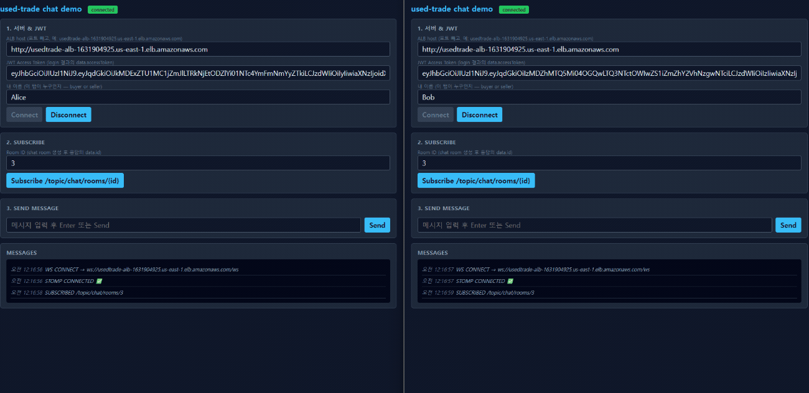
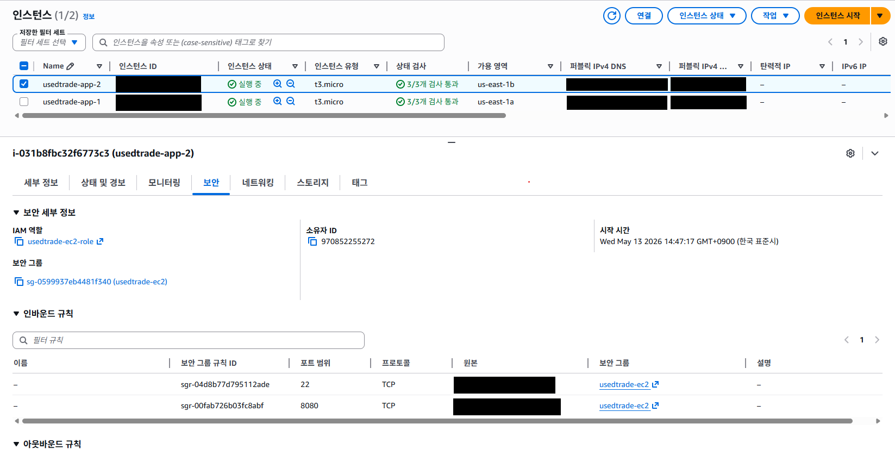
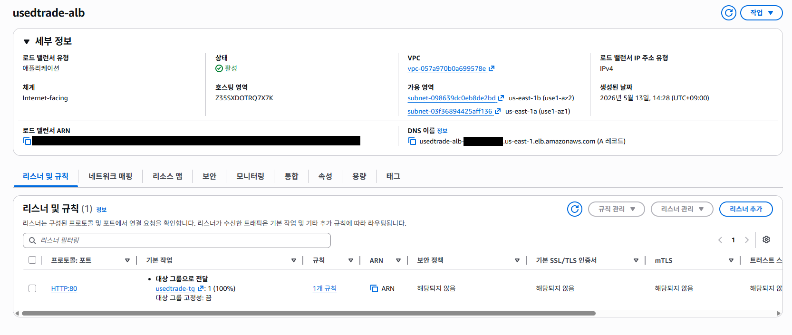
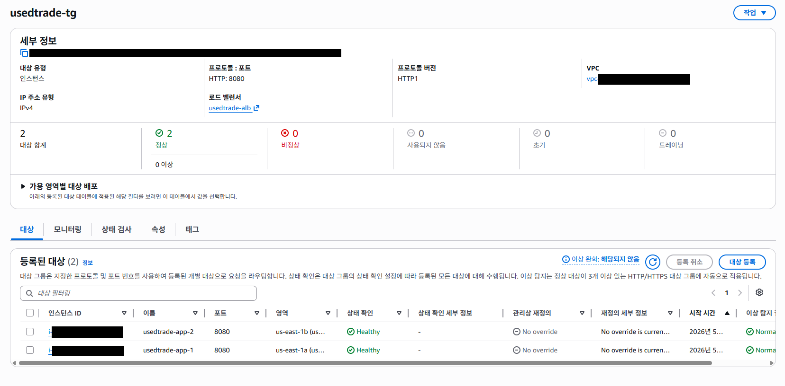
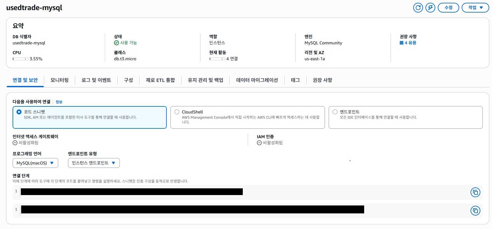
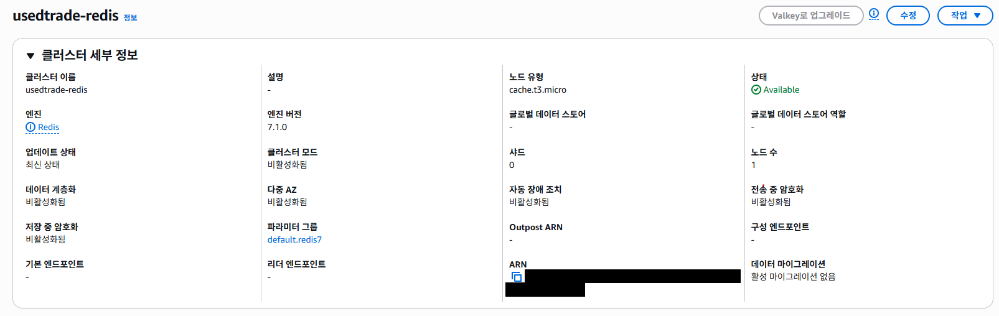

# used-trade

> Spring Boot 3 · Java 21 · MySQL 8 · Redis 7 · AWS 모듈러 모놀리스 중고거래 백엔드



> ALB 뒤 두 EC2 인스턴스에 흩어진 채팅 참여자에게 Redis Pub/Sub 채널 `chat.broadcast` 가 메시지를 릴레이.

## 측정 결과

- **동시성 제어** — 동일 상품 N=50 동시 예약, 중복 거래 3건 → 0건, p95 193ms ([ADR-2](docs/adr/002-optimistic-locking.md))
- **커서 페이징** — 깊은 페이지 OFFSET 14.40ms → CURSOR 0.71ms (20.1배) ([ADR-4](docs/adr/004-cursor-pagination.md))
- **멀티 인스턴스 채팅** — 두 JVM 간 메시지 일관성 ([ADR-3](docs/adr/003-redis-pubsub-chat.md))
- **Saga 보상** — PG 실패 시 `trade.cancel` + Product 상태 복원 자동 ([TradeSagaService](src/main/java/com/portfolio/used_trade/trade/service/TradeSagaService.java))
- **138 테스트 통과** (단위 + 통합, 0 실패)

---

## 아키텍처

### 로컬

```
            ┌────────────────────────────────────────────────┐
            │  Spring Boot 3.5 (Java 21)                     │
  HTTP/WS   │  ┌──────┐ ┌────────┐ ┌──────┐ ┌──────┐ ┌─────┐ │
   ─────►   │  │ user │ │product │ │trade │ │ chat │ │ pay │ │
            │  └──┬───┘ └────┬───┘ └──┬───┘ └──┬───┘ └──┬──┘ │
            │     └──────────┴────────┼────────┴────────┘    │
            │                    common (config / exception) │
            └──────────────┬───────────────┬─────────────────┘
                           │ JDBC          │ Lettuce
                       ┌───▼────┐      ┌───▼───┐
                       │ MySQL  │      │ Redis │
                       └────────┘      └───────┘
```

### AWS (`us-east-1`)

```
                    Internet
                       │
                  ┌────▼────┐
                  │   ALB   │
                  └────┬────┘
            ┌──────────┴──────────┐
       ┌────▼─────┐         ┌─────▼────┐
       │  EC2 #1  │         │  EC2 #2  │
       │  Spring  │         │  Spring  │
       └──┬───┬───┘         └──┬───┬───┘
          │   │                │   │
          │   └─── Redis Pub/Sub ──┘   │   (chat.broadcast)
          │                            │
       ┌──▼────────────┐         ┌─────▼──────┐
       │  ElastiCache  │         │ RDS MySQL  │
       └───────────────┘         └────────────┘
```

---

## 기술 스택

| 분류 | 사용 기술 |
|---|---|
| 언어 / 런타임 | Java 21 (Liberica JDK) |
| 프레임워크 | Spring Boot 3.5, Spring Data JPA, Spring Security, Spring WebSocket (STOMP), Spring Retry |
| 데이터 | MySQL 8.0, Redis 7 |
| 인프라 | AWS (EC2 / ALB / RDS / ElastiCache / ECR), Docker, GitHub Actions |
| 빌드 / 테스트 | Gradle, JUnit 5, Mockito, AssertJ, Spring Boot Test |

---

## 빠른 시작 (로컬)

```bash
cp .env.example .env       # 비밀번호 / JWT_SECRET 채우기
docker compose up -d       # MySQL + Redis 기동
./gradlew bootRun          # 앱 실행 (8080)
```

확인:
```bash
curl http://localhost:8080/api/hello/health-db
# {"data":{"mysql":"UP","redis":"UP"}}
```

테스트 / 벤치마크:
```bash
./gradlew test             # 단위 + 통합 (138 tests)
./gradlew benchmark        # 커서 페이징 벤치 (10만건 시드 후 100회 반복 p50)
```

데모 자료 — [docs/demo/](docs/demo/):
- Postman Collection + Environment (import 한 번으로 12개 API 시연)
- `chat-demo.html` — 두 탭으로 cross-instance broadcast 직접 시연

---

## AWS 배포

배포 절차는 [docs/deploy/aws-setup.md](docs/deploy/aws-setup.md). 비용 절감을 위해 평소엔 정지 — 시연 시 ~15분 재배포.

| EC2 (2대, 서로 다른 AZ) | ALB |
|---|---|
|  |  |

| Target Group (2/2 healthy) | RDS MySQL |
|---|---|
|  |  |

| ElastiCache Redis |
|---|
|  |

---

## 프로젝트 구조

```
com.portfolio.used_trade/
├── user/      회원 (가입 / 로그인 / refresh / 로그아웃)
├── product/   상품 (CRUD + 커서 페이징)
├── trade/     거래 (낙관적 락 + Saga)
├── chat/      채팅 (STOMP + Redis Pub/Sub)
├── payment/   결제 (Mock PG)
└── common/    config / exception / response / base entity
```

의존 방향: 도메인 → common 만 허용 (단방향).

---

## 문서

### Architecture Decision Records — 왜 그렇게 선택했나
- [ADR-1 — 모듈러 모놀리스 (vs MSA)](docs/adr/001-modular-monolith.md)
- [ADR-2 — 낙관적 락 + Spring Retry](docs/adr/002-optimistic-locking.md)
- [ADR-3 — Redis Pub/Sub 멀티 인스턴스 채팅](docs/adr/003-redis-pubsub-chat.md)
- [ADR-4 — 커서 페이징](docs/adr/004-cursor-pagination.md)
- [ADR-5 — Saga Orchestration (부분 구현)](docs/adr/005-saga-orchestration.md)
- [ADR-6 — AWS 배포 스택 선택](docs/adr/006-aws-stack-choice.md)

### Guides — 어떻게 작동하나
- [프로젝트 구조](docs/guides/project-structure.md) — 패키지 경계, 의존 규칙
- [테스트 전략](docs/guides/testing-strategy.md) — 138 테스트 분류, 도구, 의사결정
- [Docker](docs/guides/docker.md) — compose / Dockerfile 결정, ECR 워크플로우

### 배포
- [AWS 배포 절차](docs/deploy/aws-setup.md) — 수동 CLI 명령 누적
